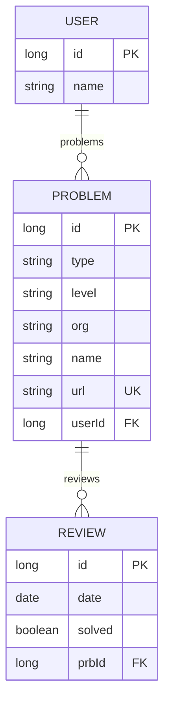

# 데이터 설계
요구사항 분석으로 필요한 데이터 추출

## 데이터 항목
- 사용자
- 문제
- 문제 유형
- 문제 레벨
- 복습 날짜
- 복습 여부
- 출처 기관
- 문제 타이틀
- 문제 URL

## 개념적 데이터 모델링
### entities
- 사용자
- 문제

### attributes
- 사용자
- 문제
  - 복습 날짜
  - 복습 여부
  - 문제 유형
  - 문제 레벨
  - 출처 기관
  - 문제 타이틀
  - 문제 URL

### relation
사용자 당 여러 문제를 가지기 때문에, 사용자 - 문제는 `1:N` 관계

## 논리적 데이터 모델링

`정규화 단계`가 적용

위 모델링은 `제 1 정규화`를 통해 복습 날짜와 복습 유형을 별도의 테이블로 분리

### ERD

참고
- [호모 아키비스트 - DB 설계하는 법(feat. 데이터 모델링)](https://yeongunheo.tistory.com/entry/DB-%EC%84%A4%EA%B3%84%ED%95%98%EB%8A%94-%EB%B2%95-feat-%EB%8D%B0%EC%9D%B4%ED%84%B0-%EB%AA%A8%EB%8D%B8%EB%A7%81#--%--%EB%BD%--%EC%--%--%EB%--%B-%--%ED%--%A-%EC%-B%-C%EB%--%-C%EB%A-%BC%--%ED%--%--%EC%-C%--%EC%--%--%--%EB%-D%B-%EC%-D%B-%ED%--%B-%EB%A-%-C%--%EB%--%--%EB%--%--%EB%-B%A--%--%EA%B-%--%EA%B-%--%EC%-D%--%--%ED%--%--%EC%-C%--%EC%--%--%ED%--%B-%ED%-B%B-%EC%--%--%--%EC%-B%A-%EC%B-%B-%EC%--%--%ED%--%B-%ED%-B%B-%EC%--%--%--%EB%A-%A-%ED%--%--%EB%--%-C%EB%-B%A--)
- [얼음연못 - [개발상식]데이터 모델링(스키마설계 하는법, DB설계하는법)](https://frozenpond.tistory.com/151)
- [Mermaid](http://mermaid.js.org/syntax/entityRelationshipDiagram.html)